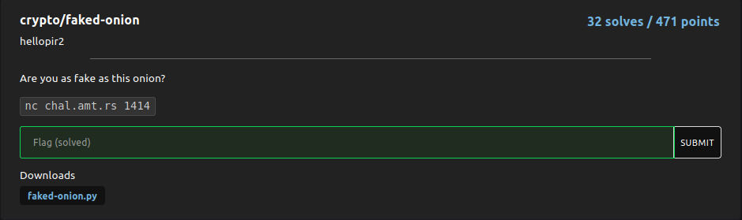
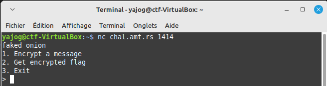
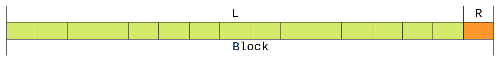
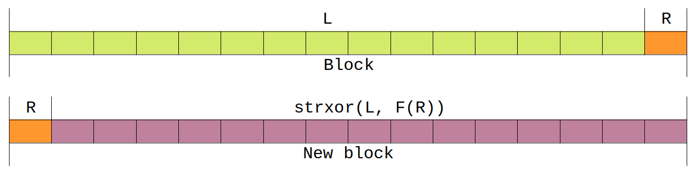

# Faked-onion

Difficulty :  :star::star:  

## Statement

  

> hellopir2  
> Are you as fake as this onion?  

> `nc chal.amt.rs 1414`  
> Downloads : [`faked-onion.py`](./faked-onion.py)  

## Discovery
We have a `PY` file and a connection to the server.  

### Connexion avec le serveur
A quick `netcat` connection to the server allows you to discover the interface implemented in the supplied file:  

  

### Le fichier `faked-onion.py`
The `PY` file is a program written in the _python_ language:  

```python
#!/usr/local/bin/python3

import hmac
from os import urandom

def strxor(a: bytes, b: bytes):
    return bytes([x ^ y for x, y in zip(a, b)])

class Cipher:
    def __init__(self, key: bytes):
        self.key = key
        self.block_size = 16
        self.rounds = 1

    def F(self, x: bytes):
        return hmac.new(self.key, x, 'md5').digest()[:15]

    def encrypt(self, plaintext: bytes):
        plaintext = plaintext.ljust(self.block_size, b'\x00')
        ciphertext = b''

        for i in range(0, len(plaintext), self.block_size):
            block = plaintext[i:i+self.block_size]
            for _ in range(self.rounds):
                L, R = block[:-1], block[-1:]
                L, R = R, strxor(L, self.F(R))
                block = L + R
            ciphertext += block

        return ciphertext


key = urandom(16)
cipher = Cipher(key)
flag = open('flag.txt', 'rb').read().strip()

print("faked onion")
while True:
    choice = input("1. Encrypt a message\n2. Get encrypted flag\n3. Exit\n> ").strip()

    if choice == '1':
        pt = input("Enter your message in hex: ").strip()
        pt = bytes.fromhex(pt)
        print(cipher.encrypt(pt).hex())
    elif choice == '2':
        print(cipher.encrypt(flag).hex())
    else:
        break

print("Goodbye!")
```

This file contains :  
- a `strxor` function;
- a `Cipher` class containing a `__init__` constructor and two `F` and `encrypt` methods;
- The body of the program proposes the menu previously observed in the terminal.  

## Analysis
### 1st and 2nd choice : encrypt a text
According to the program, a text will be encrypted by calling the `encrypt` method: 
```python
    elif choice == '2':
        print(cipher.encrypt(flag).hex())
```
The ciphertext displayed is simply the return of the `encrypt` method, which takes the flag written in hexadecimal as a parameter.  

### La méthode `encrypt`
Let's take a look at this `encrypt` method:  

```python
    def encrypt(self, plaintext: bytes):
        plaintext = plaintext.ljust(self.block_size, b'\x00')
        ciphertext = b''

        for i in range(0, len(plaintext), self.block_size):
            block = plaintext[i:i+self.block_size]
            for _ in range(self.rounds):
                L, R = block[:-1], block[-1:]
                L, R = R, strxor(L, self.F(R))
                block = L + R
            ciphertext += block

        return ciphertext
```

First, as a reminder and indication, in addition to the `Cipher` class instance (`self`), this method takes as parameter a tpye `bytes` argument, corresponding to the text to be encrypted.  

The first step is to modify the `plaintext` variable:  
```python
        plaintext = plaintext.ljust(self.block_size, b'\x00')
```
A quick search reveals the documentation for the `bytes` `ljust` method:  

> Return the string left justified in a string of length _width_. Padding is done using the specified _fillchar_ (default is an ASCII space). The original string is returned if _width_ is less than or equal to `len(s)`.  
[documentation of ljust](https://docs.python.org/3/library/stdtypes.html#string-methods)  

So, here, since the `block_size` attribute is 16 (take a look to `__init__` method), this means that the `plaintext` variable is completed on the right with bytes of zero value (`b'\x00`) to reach a length of 16 bytes.  

Let's look at the rest of the program:  

```python
        for i in range(0, len(plaintext), self.block_size):
            block = plaintext[i:i+self.block_size]
```
Here, we'll perform a loop in which the index `i` will be incremented in steps of 16 (the value of `blocksize`) from 0 up to the length of the text to be encrypted.  

We then create a `block` variable whose content is that of the `plaintext` variable between the index characters `i` and `i + 15` (in slicing, the second value is excluded).  

In other words, the `block` variable will successively take the bytes of the text to be encrypted in blocks of 16.  

As the `rounds` attribute is `1`, the following loop is of no interest.  
Next, a variable `L` will take the whole block except for the last byte, while another variable `R` will take the last byte:  

```python
                L, R = block[:-1], block[-1:]
```

For the time being, the situation can be illustrated as follows:  

  

Let's take a look at the next two lines:    
```python
                L, R = R, strxor(L, self.F(R))
                block = L + R
```  
They swap the first 15 bytes and the last byte in the block. And then, the 15 bytes (contained in the variable `L`) are replaced by sending the instruction `strxor(L, self.F(R))` where `strxor` and `F` are respectively the function and method listed earlier in the program.  
The following diagram illustrates the contents of the new cipher block:  

  

Finally, the modified blocks return to their positions in the same order:  
```python
            ciphertext += block
```

## Method `F`
Let's now analyze the `F` method, which appears when the first 15 bytes of each block are moved:  

```python
    def F(self, x: bytes):
        return hmac.new(self.key, x, 'md5').digest()[:15]
```
Here, the contents of the variable passed as a parameter are encrypted in _MD5_.  

The key is taken at random, but it should be noted that it is initialized at the start of the server connection instance and does not change until the instance is closed.  

## Function `strxor`
To complete our analysis, the classic `strxor` function performs a byte-by-byte XOR between the two values passed as parameters :  
```python
def strxor(a: bytes, b: bytes):
    return bytes([x ^ y for x, y in zip(a, b)])
```

# Solution
Pour résoudre ce challenge, il faut donc :  

- récupérer le cyphertext qu'on nommera `ct` ;
- découper en blocs `ct` que l'on stockera dans la variable `ct_blocks` ;
- découper chaque blocs en deux parties `R` et `L ^ F(R)` ;
- déchiffrer `L ^ F(R)`, élément que l'on nommera `L_` ;
- remettre dans l'ordre au sein du bloc `R` et `L_` ;
- regrouper les blocs déchiffrer pour obtenir le flag.  

## Récupérer le cyphertext

## Découper en blocs

## Récupérer 