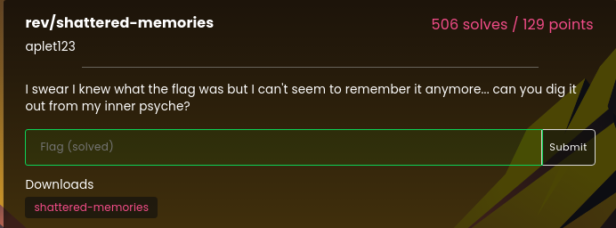
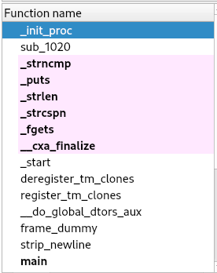
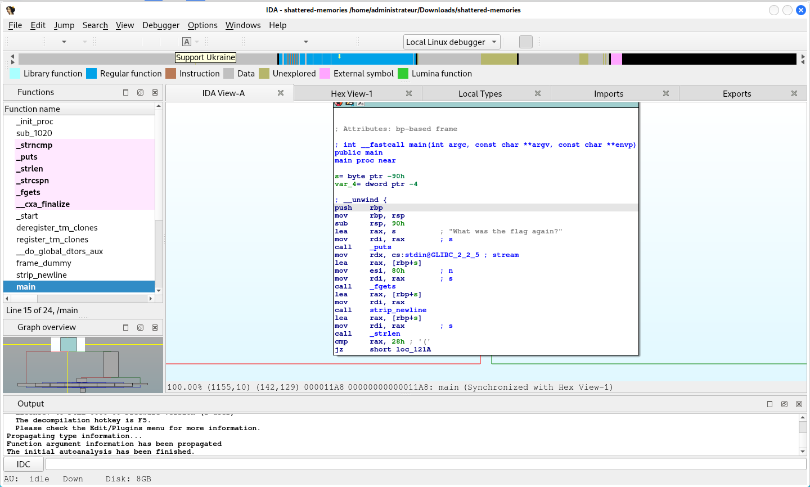
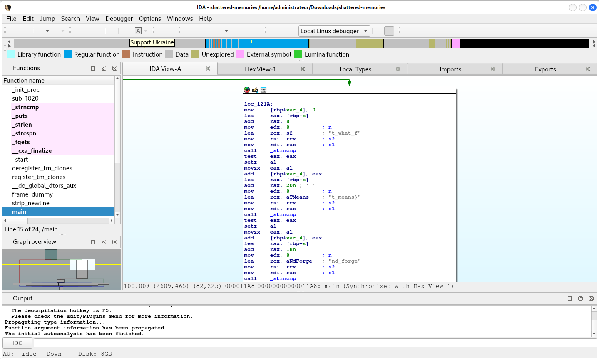
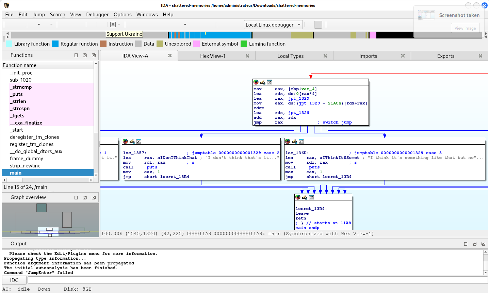
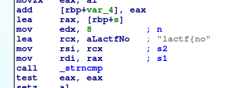

# shattered-memories - 0 pts

Difficulty :  :star:  

## Statement

> I swear I knew what the flag was but I can't seem to remember it anymore... can you dig it out from my inner psyche?  

> Dowloads : [fichier](./shattered-memories)  

**Hint** : The flag for this challenge is of the form `lactf[TEXTE_HERE]`.

  

## Discovery - Analysis
Nous disposons d'un fichier à analyser. Il faudra utiliser les outils de reverse-engering sans doute pour trouver le flag.  

## Soluce
Pour commencer, j'utilise le logiciel `IDA` en version gratuite (pas la version pro).  

J'ouvre à l'aide d'`IDA` le fichier `shattered-memories` et commence à le parcourir tranquillement pour regarder ce qu'il me propose comme fonctions :  

  

Je regarde un peu plus attentivement la fonction `main` et parcours un peu la suite :  

  

  

  

Mon regard s'attarde sur une partie contenant les caractères `lactf{no` :  

  

Il ne reste plus qu'à regarder au-dessus et en-dessous pour récupérer les morceaux du flag trouvé : `t_what_f` ; `t_means}` ; `nd_forge` ; `lactf{no` ; `orgive_a`  

Il ne reste plus qu'à tout remettre dans l'ordre pour obtenir le flag : `lactf{not_what_forgive_and_forget_means}`