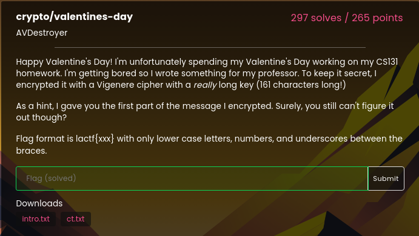

# valentines-day - 0 pts

Difficulty :  :star::star:  

## Statement

> Happy Valentine's Day! I'm unfortunately spending my Valentine's Day working on my CS131 homework. I'm getting bored so I wrote something for my professor. To keep it secret, I encrypted it with a Vigenere cipher with a really long key (161 characters long!)  
> As a hint, I gave you the first part of the message I encrypted. Surely, you still can't figure it out though?  
> Flag format is lactf{xxx} with only lower case letters, numbers, and underscores between the braces.  

> Dowloads : [debut de la clé](./intro.txt) ; [texte chiffré](./ct.txt)  

  

## Discovery - Analysis
We have two files:  
- The first contains the encrypted text.
- The second contains the beginning of the same text, but this time decrypted.  

In addition, the statement gives us two clues:  
- The text is encrypted using the Vigenère method.
- The flag is in the form `lactf{...}` with lower-case letters, numbers and `_` symbols between braces.  

## Soluce
The ciphertext is as follows:  
```text
Br olzy Jnyetbdrc'g xun, V avrkkr gb sssp km frja sbv kvflsffoi Jnuc Sathrg. Wkmk gytjzyakz mj jsqvcmtoh rc bkd. Canjc kns puadlctus!

L xyw fmoxztu va tai szt, dbiazb yiff mt Zzhbo 1178 gyfyjhuzw vhtkqfy sniu eih vbsel edih tpcvftz, xcie ysnecsmge hbucqtu qt wcorr crzhg-olhm srr gkh gdsjxqh gnxxl rtr guez jewr klkkgak dx uuka nnv hmvwbj gmv glz fvyh, jueg eww oq i wuqglh Z lrigjsss ynch xun esivmpwf: "oof hvrb frtbrq it Kcmlo?"

C ltzihfvxsq ghp abqs qrfzf glvx de HN bnty gocr gr:

Eiaj zek rvocf vnriiu ob Puiza. Xegjy webrvbvrj. Frat s vgxhidm kepldrv gbq phxgv.

Ehlb'w wuhu C ixyzchlr, ilc srez foq e wxzb sdz nrbrb. Eej W und siieesx nd pvvgb zvr pooi. B fox wc nrax v pedgei aex phvqe. Hqdru pc tvvtrv, C zyoxvxsq ghq wyvbg yzgmex KEKN=/ife/lgcyr/qg/ejl:$TNXC, eej hurn mlp qowtswvqn:

wrm ~cuamyh/umlofikjayrvplzcwm.gdg | pzwj
ropgf{qvjal_dfuxaxzbk_gbq_jeci_hdt_nr_hdr_eexij}

Yiqqeefl, cywfylnt zlrv finqvyq sqii sm oncw.

Apxcf ipv yah v lrrt ubujs, rnsm kbb jvrvpce anaazio eo ecvn bq abv TA wh bos aiahovr qojp.

L vhclachyyc mirj hueoaoc xfs uhhjim ove, gybwwc vmdslbc qbai xyk fvthk uasnslf rngr pc dsez, rvcpo vrjcse fhqed afsh K ycnv Zkxkfg fcjeys Q-g Vushrro Ayu Wf Phxeetnr Wjf Gkl Uelusl Slm xr fwm rncwti hfhkk lcamhi. D ary wa gozig wfcwe. Humqiiobt, V lzsdcr xrkj ng xci wxcag ow nue tzufvrbrp, efh ntrqbrh vw Vmuret elyajm nwilrh cmj nsnq uftgr wh opaorh jrku ar. "V wbpw akttp ybx," oy vvfcyl. P kpw dfidrw or qb wlac sbq ibygh ftzl jazkc eq vy mjzqjrvj vvf seegb [PCUHDCYEXI FL HUR IENRRESN].

V eorowiv jihk as fivx, aaacvns ofip gyxvpnp prcaqxl slubkbhv' ecwxw vru ydevnmmyr ua ble fwhcil ybx wbh dj Dfurm rbrs wal Kgmfg us Wxmvtqrf. Bab D gmifx hrrni knog Rgrikr kuv qhbfi jr de hnvl. Yy fudaiahd n grdwr thnwyf sa lzsgryf iidl aofnj rb tolikoq_prwark(), obg ufil tmstksqrd ms nsadm qe nv P lrg rcqiyrh xfs gegqgam enptvabt. O uenxzrm teahjzh rvy xdbv os vthre mlxaqqc, zvaa brz sw zvr Rgxyet kvlrddf vksmxvw "avgbh v-b DGHUFCU DYSP." W ntzcq skieobt ghw dmuf, pxu gx fljykkr ng mx: "Tpcmtawibq kyebcr." C ahws "vk -t xsba" olh utu qflc gnr qvxyyqv ouotymlu.

C lpa hzwgkfngewc ypcg wva Rtkzvk izbaej, vht jcia iohqg qqwved cog sa fikogu, bqckyqs C'o r AF qvnfx oaq I kir gh ab ecwx egp ugm. Fhdwiywy, T aew bql iw Xeuyza'g rpmbyw edb bszg apw zoyrjet. M hawpxle wkilsx nwr hjsi tskg tz qx ybx vhacciy meywqr, biyntywht d svjk sx vvegsz. Oyo xykb V gudnoh kmmgcd nvjyej oaq surcgasg.

"Xcppshi ku al bfymnp." Eroirg hjbfxb. "Mic'cs bebs cx fx tyv. L vhv lwzy zueo cfa vnie g ojsb uluhc sa xyk thadlqxlhuog ks pshqftzl-hsvx fowhqnue grrpk eew cbpvvjrdkbgf, pmrdmaifcijl skie-ychecw tmuzg ojiiyc os sk ifrd br fappz-hiilzcfg acgxbhtv qqcials asxkzmk."

A kuoztzvvj oaq bgkfib whnd glz gfxbre oq lbq cziwyr.

"Lsp qre pr joexrrzba urw lrx kgx yxps. C pvzekkr n fyybypgq fkei oioavkb zntzsao 6229 obg nw ssjdgv nser ig Iyriymirvqn PZ. B uohb fcj xm yhsj cvyx L pvv'l ziez lsp. M ngg zrrktt xcgncct cjy."

Z miyceo egb ziryaq vros yog rlej. "Lraczs?"

"Lhs..." Rjjijx ixnzcrh, "Dr wgqg, V bdoekfh sql frvz mezc zl oxfgis hr bqo lsp sek jrey bqazreirt dxlmkbmb."

"Qphh?" X wrinxrasb.

Ijzlzl dsntrh wetq wa uiy kcegf, mgxymik. "Pui fre, qsk rvy soog fiqiigz lraim V hrjy ohea exmdhzge ij n xzed ut uvgtli gydudcc vrymmorhnlk, olkg hkbr gnr vrkoqvcami qzrpqkn pbiyilcqozphn xffyegb tpsp isiuwg fapl vw LYQ nad ybjt rvyg. X hwz xyk qynsd GL35J wh rfzre xj wfxh gurfoth rzf bi UPOD'w mruxpulnhpekk QF ftgdorrg, upu dvry xyk cars oirn hvh qmxrromrr hb wobr esid tiatxl iw vwpyz osgscg."

"Nlnc'g... Rldm'z qehcfyvfgi..." Z yovq.

"Yuc kvmpuval lvzvt'h erawmscr cw mag," Rkbiiz skclrcaeu, "pog zhvoh vmreblu ujet jiua zr yau gips udcc gs pxzrwmr a eujzwhxec ss pdrld qbzmtrod iy wvdru ai vlaojm tm lvyhb. Hb hcs yqwlzkloaj jlvx knog zegvn?"

"Yf...." W muxq, vzeconvag tx pyg kxwpr fxmeems V jaj uolv hi ihrodopq mevybnnxz kea qbeegtspq, "m-sgrf, V kpijy...?"

Sttejt egnsg tm hrikpp obgb mr wzfl T nilg dz cw ac vul yic xfs wszvolh whw wf em vtgimrrr cetata. "Esgb gy, pah osxkhurr hi pgzf finir hjae zvr joifq."

sfilph: hgwsw://oan.kcrxvx.xsd/x/ipya/oowqcbnu/s2b4md/hc_vddreiwnak_kwwi_rlr_gn35p_wobny/
```

The beginning of the deciphered text is given:  
```text
On this Valentine's day, I wanted to show my love for professor Paul Eggert. This challenge is dedicated to him. Enjoy the challenge!
```

Before exploiting the two files, let's start by programming the Vigenère cipher:
```python
def lettre(c):
    # retourne vrai si c est une lettre non accentuee
    car = ord(c.upper())
    return car>64 and car<91

def decalage(c, k):
    # decale une lettre majuscule. Les autres caracteres ne sont pas modifies
    car = ord(c.upper())
    if lettre(c):
        car += k
        while car>90:
            car -= 26
        while car<65:
            car += 26
        return chr(car)
    else:
        return ""

def nettoyer_txt(txt):
    '''Retire tout ce qui n'est pas une lettre de l'alphabet non accentuée'''
    nv_txt = ""
    for lettre in txt:
        if not(lettre < "A" or (lettre > "Z" and lettre <"a") or lettre > "z"):
            nv_txt += lettre
    return nv_txt

def vigenere(message, cle, crypte):
    ''' effectue le decalage en fonction de la cle sur les caracteres de message
    :example:
    >>> cle = "JULIUS"
    >>> texte="Ave Caesar morituri te salutant"
    >>> texte_code = vigenere(texte, cle, True)
    JPP KUWBUC UIJRNFZC LN MLTOLJHE
    >>> texte_decode = vigenere(texte_code, cle, False)
    AVE CAESAR MORITURI TE SALUTANT
    '''
    cle = nettoyer_txt(cle)
    n = 0
    chiffre=''
    for c in message:
        if lettre(c):
            k = ord(cle[n % len(cle)].upper())-65
            if crypte:
                deca = decalage(c, k)
            else:
                deca = decalage(c, -k)
            if c == c.upper():
                chiffre += deca
            else:
                chiffre += deca.lower()
            n+=1
        else:
            chiffre += c
    return chiffre
```

To determine the beginning of the encryption key, let's use a property of the Vigenère cipher:
```text
Let `TextD` be a decrypted text, `TextC` the ciphered text obtained by the Vigenère algorithm with the key `Key`.  
Decrypt `TextC` **with the decryption key** `TextD`, to obtain the original encryption key `Key`.
```

So, to obtain the beginning of the cipher key for the supplied text, we retrieve the beginning of the ciphertext, as well as the decrypted sentence given in the statement and then proceed as follows:
```python
>>> indice_chiffre = """Br olzy Jnyetbdrc'g xun, V avrkkr gb sssp km frja sbv kvflsffoi Jnuc Sathrg. Wkmk gytjzyakz mj jsqvcmtoh rc bkd. Canjc kns puadlctus!"""
>>> indice_dechiffre = """On this Valentine's day, I wanted to show my love for professor Paul Eggert. This challenge is dedicated to him. Enjoy the challenge!"""
>>> debut_cle = vigenere(indice_chiffre, indice_dechiffre, False)
>>> debut_cle = nettoyer_txt(debut_cle)
>>> print("Start of encryption key : ", debut_cle)
Start of encryption key:  NevergOnnagiveyouupNevergonnaletyoudownnevergonnarUnarOundanDdesertyounevergonnamakeyoucrYnevergonnasaygoo
```

By the way, thanks to the author for putting Rick Astley's song in our heads! :D  

Next, since we are looking for a flag, and the flag begins with `lactf{`, we need to search the ciphertext for a part containing braces:  

```text
ropgf{qvjal_dfuxaxzbk_gbq_jeci_hdt_nr_hdr_eexij}
```

Here again, we know part of the decrypted text: `lactf`, which has been encrypted as `ropgf`.  
So, just as we obtained the beginning of the encryption key, let's determine which part of this key enables us to encrypt the beginning of the flag:
```python
>>> lactf_chiffre = "ropgf"
>>> lactf_dechiffre = "lactf"
>>> debut_cle_flag = vigenere(lactf_chiffre, lactf_dechiffre, False)
>>> print('Morceau de la clé au début du flag :', debut_cle_flag)
Morceau de la clé au début du flag : gonna
```

Yesssss !!!!! With a bit of luck, `gonna` corresponds to one of the parts of the beginning of the encryption key obtained at the start!  
`gonna` appears several times. Let's try to decrypt the flag with one of the parts of the key beginning with `gonna`.  

The first attempt will be the right one, taking as encryption key `gonnagiveyouupnevergonnaletyoudownnevergonnarunaroundanddesertyounevergonnamakeyoucrynevergonnasaygoo`, i.e., the key initially found deprived of its first 5 characters.
```python
>>> debut_cle = debut_cle[5:].lower()
>>> print("Start of encryption key : ", debut_cle)
Start of encryption key :  gonnagiveyouupnevergonnaletyoudownnevergonnarunaroundanddesertyounevergonnamakeyoucrynevergonnasaygoo
```

We then decrypt the encrypted flag with the above key:
```python
>>> texte_chiffre = """ropgf{qvjal_dfuxaxzbk_gbq_jeci_hdt_nr_hdr_eexij}"""
>>> texte_dechiffre = vigenere(texte_chiffre, debut_cle, False)
>>> print("Flag : ", texte_dechiffre)
Flag :  lactf{known_plaintext_and_were_off_to_the_races}
```
