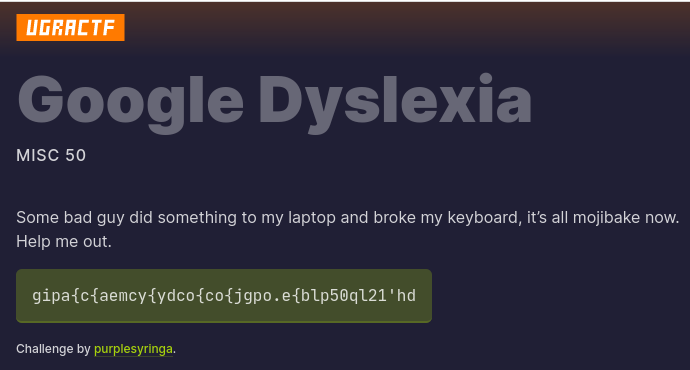
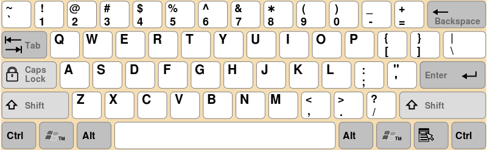
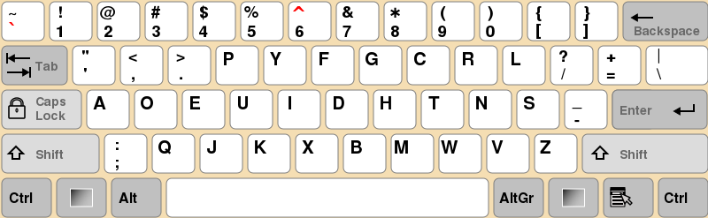
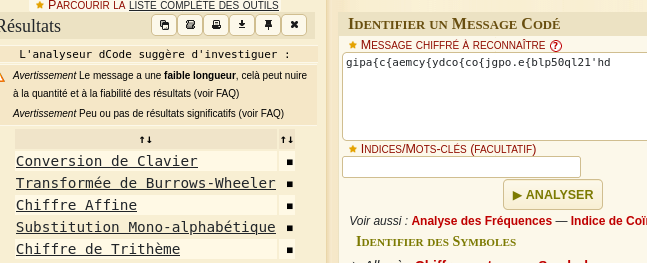
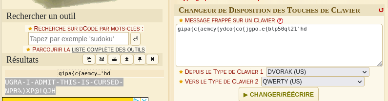
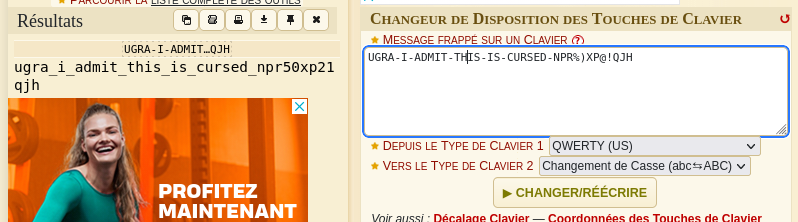

# Google Dyslexia - 50 pts

Difficulty :  :star:  

## Statement

> Some bad guy did something to my laptop and broke my keyboard, it's all mojibake now. Help me out.  
>  
> `gipa{c{aemcy{ydco{co{jgpo.e{blp50ql21'hd`  
>  
> Challenge by purplesyringa.  

**Hint** : The flag for this challenge is of the form `ugra_[A-Za-z0-9_]+`.

  

## Discovery - Analysis
The introductory sentence indicates that a keyboard is broken, probably causing unexpected characters to be displayed.  

We also have a string of characters, all of which can be printed and obtained using the keys on a keyboard.  

## Soluce
All we have is a string of characters, so all we have to do is decrypt it.  

Starting with four letters and then a `{` reminds me of a monoalphabetic substitution.  
So let's start quietly to get an idea of this substitution:  
`g -> u`; `i -> g`; `p -> r`; `a -> a` and `{ -> _`.  

There are still quite a few unknown characters.  

Nevertheless, I've noticed that on these first five characters, a letter is replaced by a letter, which makes me think of a change in keyboard type. It remains to be seen which keyboard has been replaced by which.  

A quick search reveals a few ideas for the organization of the keys: [Page wikipédia](https://fr.wikipedia.org/wiki/Disposition_des_touches_d%27un_clavier_de_saisie)  

So we need a keyboard with relatively different keys in the same places, but with the `A` key remaining in the same place: **QWERTY** and **DVORAC** :  

   

A quick look verifies that the first five substitutions already observed match, so all that remains is to continue the substitution to obtain the flag: `ugra_i_admit_this_is_cursed_npr50xp21qjh`.  

## Alternative soluce
Using the [Dcode.fr](https://www.dcode.fr) website, it's possible [to detect](https://www.dcode.fr/identification-chiffrement) that the character string is decryptable [by changing the keyboard](https://www.dcode.fr/chiffre-changement-clavier), then selecting both keyboards to obtain the decrypted string. All that remains is to change it to lower case to obtain the flag.  

    

**Image credits** :  
Michka_B, CC BY-SA 4.0 <https://creativecommons.org/licenses/by-sa/4.0>, via Wikimedia Commons