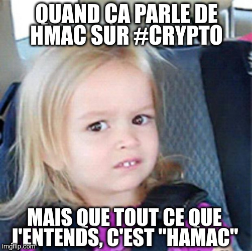

# Hamac

_intro_ _crypto_ _Symétrique_ _FCSC2022_  

## Description

Connaissez-vous l’existence de `rockyou` ?  

  

**Fichiers** : [hamac.py](./hamac.py) et [output.txt](output.txt)  

**Auteur : Cryptanalyse**

## Elements de réponse

Le chiffrement consiste tout d'abord à demander un mot de passe. Ce dernier sert alors à générer une clé `k` pour le chiffrement AES.  
L'énoncé nous met sur la piste en nous incitant à nous rapprocher de `rockyou.txt`, un fichier texte contenant une liste très très importante de mots de passe commun, fréquemment utilisés dans le monde. Le mot de passe utilisé pour la clé ici serait-il commun et donc ferait-il partie de ce fichier ? L'énoncé nous le laisse penser ...  

Aussi, dans un premier temps, on parcourt le dit fichier `rockyou.txt`, initialement récupéré sur le web (il est facile à trouver, comme ici : [https://github.com/zacheller/rockyou](https://github.com/zacheller/rockyou)). On teste si le hash de chacun des mots de ce fichier correspond au hash fourni dans le fichier `output.txt` fourni.  

Bingo ! Après un peu de temps à mouliner, on tombe sur le mot _omgh4xx0r_ :)  

Maintenant que l'on connait le mot de passe utilisé pour la génération de la clé, il ne reste plus qu'à déchiffrer le texte chiffré fourni également avec l'`iv` dans le fichier `output.txt`.  

## Flag

`FCSC{5bb0780f8af31f69b4eccf18870f493628f135045add3036f35a4e3a423976d6}`

